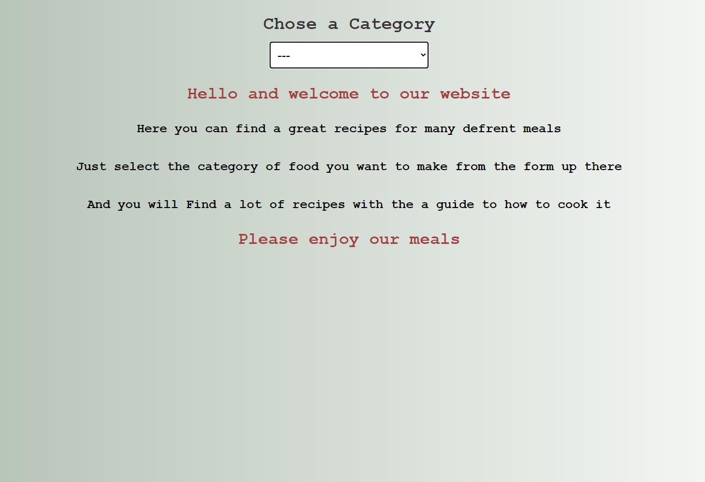
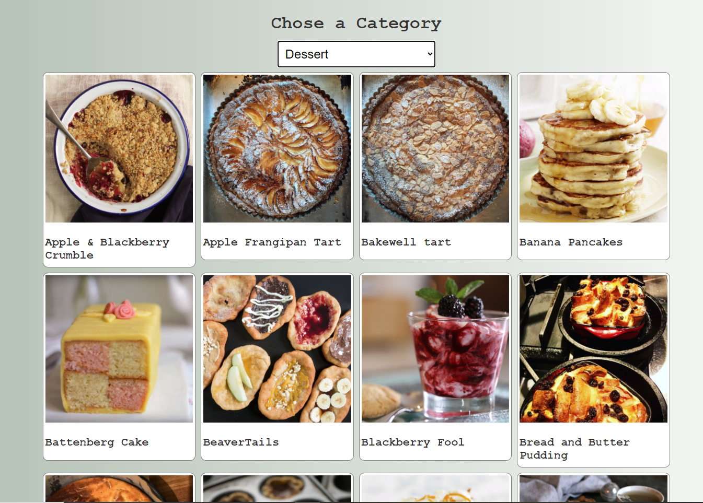

# FindRecipe

This project is a React webapp that allow users to search for recipes by category and then display a list of all the meals user can make from that category

### Live Link

[click here](https://finderecipe.herokuapp.com/)

### Presentition

[Video](https://www.loom.com/share/efb3709388204a75a0ee4dc08683b7c7)

### ScreenShot




## Built With

- React
- Redux
- JSX
- CSS
- JavaScript
- ESLint
- Jest
- VS Code
- NPM
- Axios

## Prerequisites

You must have a browser on your PC in order to use the application. [Click here](https://www.mozilla.org/en-US/firefox/new/) to download one.

you must have [NodeJS](https://nodejs.org/en/)

## Getting Started

1. clone the project

```bash
# Clone this repository
$ git https://github.com/rida-elbahtouri/Findrecipie.git

# Go into the repository
$ cd Findrecipie


```

**You can Install the dependencies with this commands**

```bash
$ npm install

```

### start the app

```bash
$ npm  start
 # and open the link provided
```

### run Tests

```bash
$ npm  test
#Or
$ npm run test
 # and open the link provided
```

## Authors

👤 **Rida Elbahtouri**

- [Github](https://github.com/rida-elbahtouri)
- [Twitter](https://twitter.com/RElbahtouri)
- [Linkedin](https://www.linkedin.com/in/rida-elbahtouri/)

## 🤝 Contributing

Contributions, issues and feature requests are welcome!

Feel free to check the <a href="https://github.com/rida-elbahtouri/Findrecipie/issues" target="_blank">issues page</a>.

## Show your support

Give a ⭐️ if you like this project!

## Acknowledgments

- <a href="https://reactjs.org/" target="_blank">React js</a>
- <a href="https://redux.js.org" target="_blank">Redux JS</a>
- <a href="https://www.themealdb.com/api.php" target="_blank">Themealdb </a>(The Api Used to get data)
